# Process Digraph

```graphviz
digraph G {
    rankdir=BT;
    node [shape=box, style=rounded, fontname="sans-serif"];
    graph [fontname="sans-serif"];
    edge [fontname="sans-serif"];

    output_pdf [
        label = "search results pdf",
        style = "filled,rounded",
        fillcolor = "#c97a2e", // accent orange-brown
        color = "#c97a2e",
        fontcolor = "#f4ece2",
        margin = "0.62,0.382", //
    ];
    search [
        label="⚗️✨",
        fontsize = 42.35,
        shape = "plain",
    ];
    search_label [
        label=<
            <table border="0" cellborder="0" cellspacing="0">
                <tr><td align="left">search function</td></tr>
                <tr><td align="left">    evaluator(attention_matrix)</td></tr>
                <tr><td align="left">    returns scalar score</td></tr>
            </table>
        >,
        fontsize = 10,
        shape = "plain",
        fontcolor = "#5a6e8c", // slate blue (accent cool)
    ];
    heads_label [
        label=<
            <table border="0" cellborder="0" cellspacing="0">
                <tr><td align="left">attention heads</td></tr>
                <tr><td align="left">    - pdf visualizations</td></tr>
                <tr><td align="left">    - csv data export</td></tr>
                <tr><td align="left">    - png images</td></tr>
            </table>
        >,
        style = "plaintext",
        color = "invis",
        fontsize = 10,
        fontcolor = "#5a6e8c", // slate blue (accent cool)
    ]
    subgraph cluster_heads {
        style="filled,rounded";
        color="#b2b2b2"; // neutral gray
        
        heads_pdf [
            label="📊",
            style = "plaintext",
            fontsize = 42.35,
            color = "invis",
       ];
        heads_csv [
            label="🗃️",
            style = "plaintext",
            fontsize = 42.35,
            color = "invis",
        ];
        heads_png [
            label = "🌌",
            style = "plaintext",
            fontsize = 42.35,
            color = "invis",
        ];
            { rank=same; heads_png; heads_label; }

    }

    model [
        label="⚙️",
        fontsize = 68.54, // 10 x goldenratio^4
        shape = "plain",
    ];
    model_label [
        label=<
            <table border="0" cellborder="0" cellspacing="0">
                <tr><td align="left">AutoModel</td></tr>
                <tr><td align="left">    .from_pretrained</td></tr>
                <tr><td align="left">    bert-base-uncased</td></tr>
            </table>
        >,
        shape = "plain",
        fontsize = 10,
        fontcolor = "#5a6e8c", // slate blue (accent cool)
    ];
    
    tokenize [
        label="🧩",
        fontsize = 42.35, // 10x golden ratio cubed
        shape = "plain",
    ];
    tokenize_label [
        label=<
            <table border="0" cellborder="0" cellspacing="0">
                <tr><td align="left">AutoTokenizer</td></tr>
                <tr><td align="left">    .from_pretrained</td></tr>
                <tr><td align="left">    bert-base-uncased</td></tr>
            </table>
        >,
        fontsize = 10,
        shape = "plain",
        fontcolor = "#5a6e8c", // slate blue (accent cool)
    ];
    text_input [
        label = "\"augusta national is ...\"",
        style = "filled,rounded",
        // accent cool blue fill
        color = "#5a6e8c",
        fillcolor = "#5a6e8c",
        fontcolor = "#f4ece2",
        margin = "0.62,0.382",
    ];
    text_input_label [
        label=<
            <table border="0" cellborder="0" cellspacing="0">
                <tr><td align="left">text_input</td></tr>
                <tr><td align="left">    - sentence string</td></tr>
                <tr><td align="left">    - raw text data</td></tr>
            </table>
        >,
        fontsize = 10,
        shape = "plain",
        fontcolor = "#5a6e8c", // slate blue (accent cool)
    ];
    
   

    // core edges
    text_input -> tokenize;
    tokenize -> model;
    model -> heads_csv;
    model -> model_label [style=invis];
    heads_csv -> search;
    search -> output_pdf;

    // labels
    text_input -> text_input_label [style=invis, width=0, height=0];
    tokenize -> tokenize_label [style=invis, width=0, height=0];
    search -> search_label [style=invis, width=0, height=0];
    heads_png -> heads_label [style=invis];

    { rank=same; text_input; text_input_label; }
    { rank=same; search; search_label; }
    { rank=same; model; model_label; }
    { rank=same; tokenize; tokenize_label; }

}
```

## shapes digraph

```graphviz
digraph structs {
    rankdir=LR;
    node [
        shape=box,
        style="filled,rounded",
        fillcolor="#5a6e8c", // slate blue (accent cool)
        color="#5a6e8c",
        fontcolor="#f4ece2",
        fontname="sans-serif",
        fontsize=10,
        margin="0.4,0.1",
    ];
    input_string
    [
        label="augusta national is"
    ];
    tokenizer
    [
        label="<f0>Tokenizer|<in>▶ string|<out>tokens ▶",
        shape="record",
        fillcolor="#86909f", // average of cool (#5a6e8c) and neutral (#b2b2b2)
        color="#86909f",
    ];
    model [
        label="<f0>Model|<in>▶ tokens|<out>attention_heads ▶",
        shape="record",
        fillcolor="#b2b2b2", // neutral gray
        color="#b2b2b2",
    ];
    search_fn [
        label="<f0>Search Function|<in>▶ attention_heads|<out>pdf results ▶",
        shape="record",
        fillcolor="#bd9670", // average of neutral (#b2b2b2) and warm (#c97a2e)
        color="#bd9670",
    ];
    final_pdf [
        label="Search Results PDF",
        fillcolor="#c97a2e", // copper (accent warm)
        color="#c97a2e",
    ];
    input_string -> tokenizer:in;
    tokenizer:out -> model:in;
    model:out -> search_fn:in;
    search_fn:out -> final_pdf;
}
```

## views of bert heads
./heads_csv
./heads_pdf
./heads_png

## formatted results for export
./output_pdf
./output_png

## deut-compensated palette

color | hexcode | description
 --- | --- | ---
 linen | `#f4ece2` | background
 neutral gray | `#b2b2b2` | field neutral
 champagne | `#e6cebc` | field warm
 slate blue | `#5a6e8c` | accent cool
 copper | `#c97a2e` | accent warm

## original palette
color | hexcode | description
 --- | --- | ---
 linen | `#f4ece2` | background
 artichoke | `#a2a182` | field cool
 champagne | `#e6cebc` | field warm
 xanadu | `#687259` | accent cool
 chestnut | `#8e412e` | accent warm

